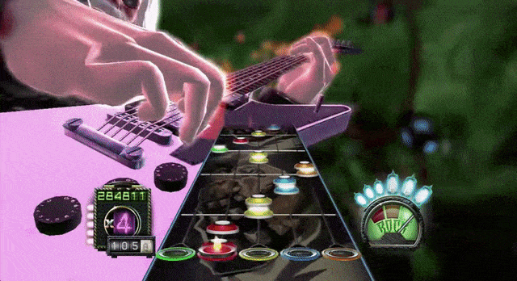
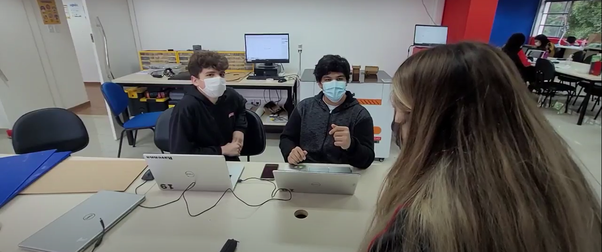
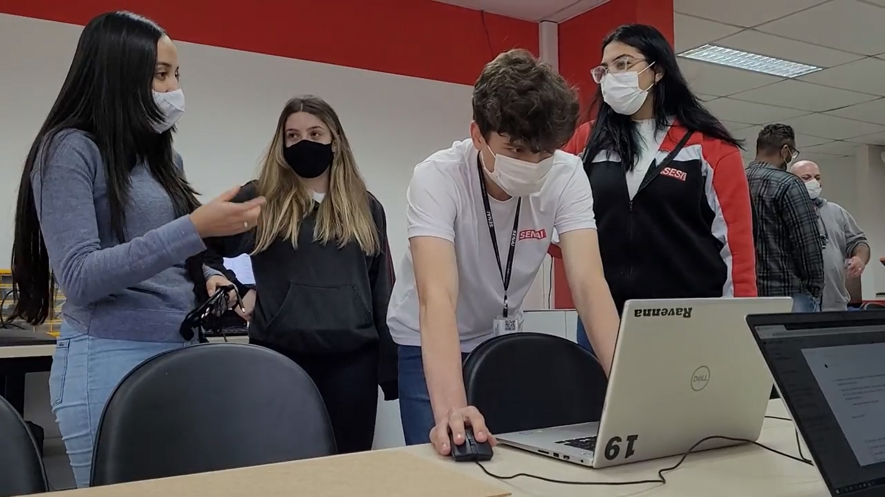
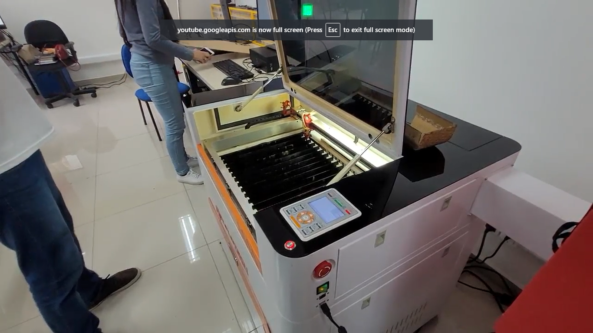
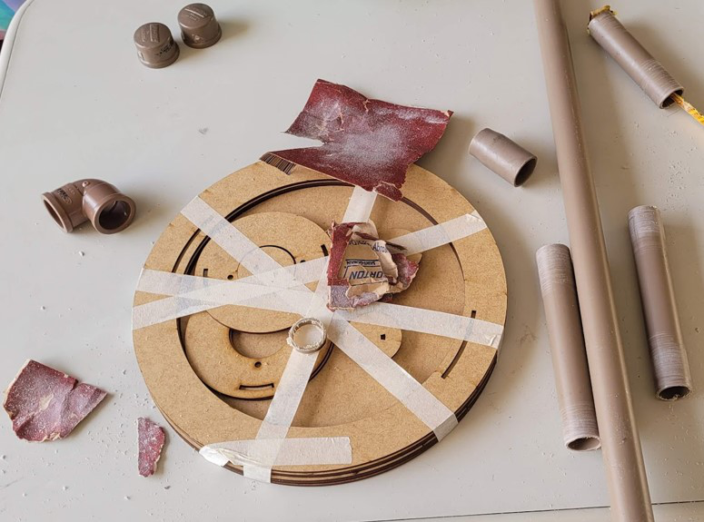
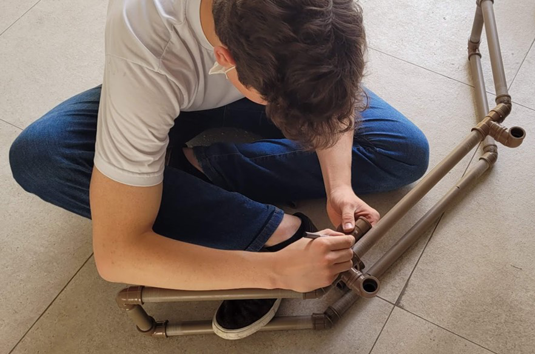

    

<h1 align="center">Bateria Musical Eletrônica</h1>

Uma bateria musical funcional feita do zero com diversos elementos da Cultura Maker

<h3 align="center">🚧 Em construção 🚧</h3>

 <a href="#-integrantes">Integrantes</a> • 
 <a href="#-ideia">Ideia</a> • 
 <a href="#-escolha-dos-materiais">Escolha dos materiais</a> • 
 <a href="#-contribuindo">Contribuindo</a>

# 👤 Integrantes
Esse projeto foi desenvolvido durante o ano de 2021 no SESI Vila das Mercês, na matéria de Eixo Integrador, pelos estudantes:

  <table style="width:100%">
      <tr align=center>
          <th><strong>Eduardo Santos Barreto</strong></th>
          <th><strong>Heloisa Bitencourt dos Anjos</strong></th>
          <th><strong>Jessica Barbosa do Nascimento</strong></th>
          <th><strong>Lívia de Souza Negrini</strong></th>
          <th><strong>Mariana Costa Barbosa</strong></th>
          <th><strong>Manuela Salmeron de Oliveira</strong></th>
          <th><strong>Samuel Oliveira Costa</strong></th>
      </tr>
      <tr align=center>
          <td>
              
          </td>
          <td>
              
          </td>
          <td>
              
          </td>
          <td>
              
          </td>
          <td>
              
          </td>
          <td>
              
          </td>
          <td>
              
          </td>
      </tr>
  </table>

Orientadores:
- Vicente Arthur Viadana Neto
- Priscilla Moore Scaldaferri
- Wagner Manço da Luz

# 💡 Ideia
Durante o ano de 2021, decidimos desenvolver um projeto com **robótica**, mas sempre buscamos relações e inspirações em outras áreas para desenvolver o que queremos. Dessa vez não foi diferente, resolvemos juntar isso com outras duas coisas que gostamos muito: a **música** e os **jogos**.

A maioria das pessoas da nossa geração já jogou algum jogo relacionado a música, os mais conhecidos são o **Piano Tiles** (aquele joguinho de celular que você tem que apertar as teclas no momento certo) e o precursor e inspirador dele: o **Guitar Hero**, mais conhecido e um pouco mais complexo, envolvendo até instrumentos da vida real sendo adaptados como controles desse jogo, como guitarras, microfones e nesse caso, baterias.

    </img>
    </img> 

Foi pensando nisso que decidimos fazer a nossa própria **bateria do zero**.

# 📦 Escolha dos materiais
## Estrutura
Para começar a definir os materiais e componentes que precisaríamos, sempre tentando deixar tudo o mais simples e barato possível, desenhamos a estrutura no [Fusion 360](https://www.autodesk.com/products/fusion-360/overview), um software de modelagem 3D que ja tínhamos experiência.

Ela começou como uma bateria inteira, com a parte inferior de sustentação e a estrutura superior que segura os tons e os pratos.

Com os desenhos prontos, a tarefa de definir os materiais ficou bem mais simples. Definimos o seguinte:

- Estrutura principal de sustentação: Canos de PVC
- Tons e pratos: MDF
- Encaixes especiais: Impressão 3D

Quando analisamos nossos prazos e orçamentos, decidimos retirar o apoio inferior com os canos de PVC, diminuindo muito o custo e o tempo pra montar a versão final, se transformando numa espécie de **bateria de mesa**.

## Eletrônica
Ainda faltava decidir como seria a parte **eletrônica** da bateria, responsável por entender onde o jogador está batendo e enviar os sinais para o computador.

Para a bateria sentir onde foi a batida, decidimos usar **cápsulas piezoelétricas**, que são placas de quartzo que podem funcionar como uma espécie de **sensor de vibração**. Quando batemos num prato, por exemplo, o prato vibra e essa vibração chega no sensor, que gera um sinal elétrico.

     

Para gerenciar esses sinais, escolhemos um **microcontrolador** chamado **Arduino Pro Mini**, por ele ser bem compacto e ter uma semelhança intressante com o Arduino Leonardo, que é outra versão dessa família de microcontroladores: Eles conseguem **simular o pressionamento de uma tecla**, como se fosse um teclado conectado ao computador, assim conseguimos jogar qualquer jogo que dependa disso, desde o jogo da cobrinha, o dinossauro do Google e até o Guitar Hero, que é o nosso objetivo.

    

# 🛠️ Confecção

## FabLab
Com os materiais definidos e os desenhos prontos, começamos finalmente a colocar a mão na massa: Fomos cortar as chapas de MDF para os tons e os pratos e imprimir as peças na impressora 3D.

Para isso, visitamos o **FabLab** do SESI Ipiranga, que é um laboratório criado para desenvolver a Cultura Maker, com impressoras 3D, máquina de corte a laser e tudo que é relacionado ao conceito de **fabricaçao digital**.

    </img>
    </img> 
    </img> 

Todas as partes de madeira foram cortadas na máquina de corte a laser de lá, é um processo muito legal e rápido, ideal pra esse tipo de projeto com um protótipo.

Infelizmente a impressora 3D de lá estava em manutenção.

## Montagem da bateria

Com todas as partes prontas, começamos a juntar tudo para montar a bateria. Essa parte foi mais simples, já que tínhamos os desenhos com todas as medidas corretas.

Compramos os canos de PVC, mas precisávamos de uma serrinha para cortar e só tínhamos uma cegueta, daí improvisamos o "**Dentinho**": uma espécie de suporte com um resto de cano de PVC que sobrou, um pedaço de MDF de uma placa que acabamos cortando errado no FabLab, o cabo de um pirulito e um pouco superbonder. Foi uma gambiarra mas serviu muito bem pra gente.

    </img>
    </img> 

Depois começou uma parte um pouco mais complexa: encaixar tudo com as partes que imprimimos na 3D. Um problema de refrigeração fez essas partes impressas ficarem com algumas imperfeições, então tivemos que adaptar cortando e desbastando com um estilete e o dentinho.

Pintamos os tons e pratos de MDF para encaixar na estrutura e a bateria estava quase pronta, só faltava a parte eletrônica.

## Eletrônica
Essa parte não é tão complicada, tivemos alguns tropeços pra fazer funcionar mas deu certo. O circuito final é simplesmente o sensor piezo conectado num resistor interno do arduino e isso tudo ligado no computador via USB pra simular o teclado. A programação segue passos bem simples também, só identifica e filtra os sinais do sensor e envia o aperto de uma tecla para o computador.

> Mais detalhes podem ser encontrados nos [nossos testes](/Testes/README.md).

> A [pasta src](/src) contém programações para diferentes jogos, basta carregar e jogar.

# 📫 Contribuindo
Se quiser contribuir com este projeto basta seguir essas etapas:

1. Faça um Fork desse repositório
2. Crie um branch: `git checkout -b <nome_branch>`.
3. Faça suas alterações, adicione e confirme: `git add .` e `git commit -m "<mensagem_commit>"` (em português, por favor)
4. Envie para a branch original: `git push origin master`
5. Crie o pull request.

Você também pode ver na documentação do GitHub [como criar um pull request](https://help.github.com/en/github/collaborating-with-issues-and-pull-requests/creating-a-pull-request).

> Stars são sempre bem vindas :)
