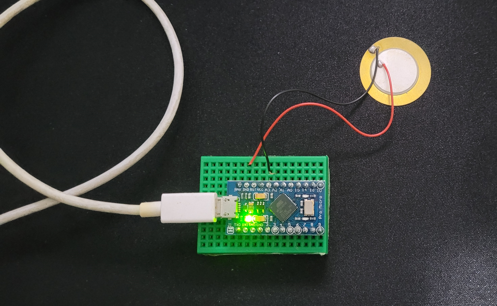
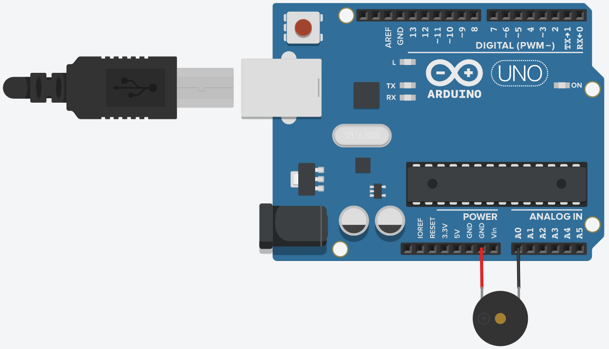

# Testes com as cápsulas piezoelétricsa
## Teste 1
O primeiro teste foi com apenas um sensor ligado do GND a uma porta analógica com o resistor interno do arduino.

Circuito | Diagrama
---------|---------
 |  
> O positivo do piezo está no GND para funcionar com o `INPUT_PULLUP`

### Demonstração
<video controls>
  <source src="./Piezo_1/Video.mp4" alt="Demonstração do teste">
</video>

