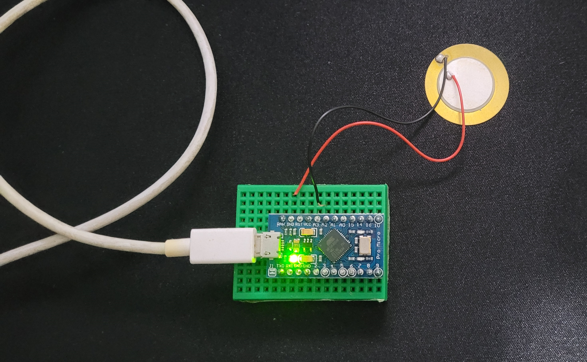
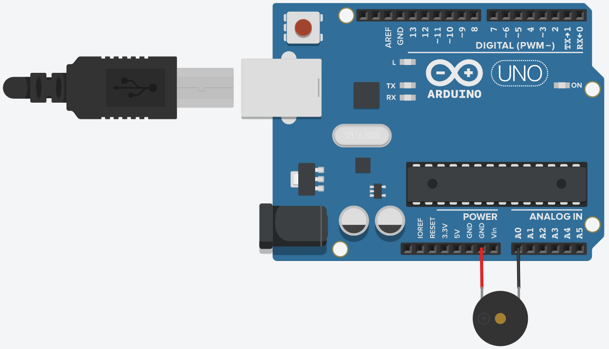
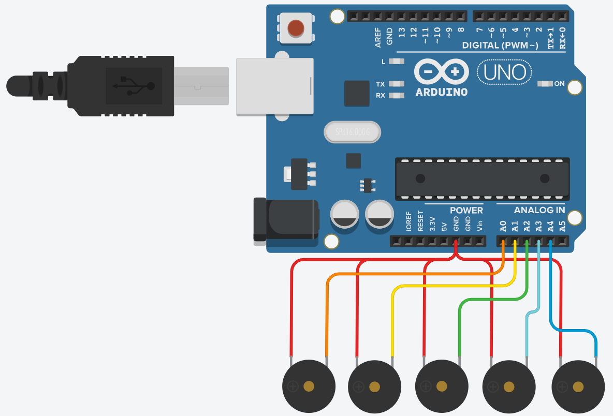

# Testes com as cápsulas piezoelétricas
## Teste 1
O primeiro teste foi com apenas um sensor ligado do GND a uma porta analógica com o resistor interno do arduino. O objetivo era obter as leituras analógicas para garantir o funcionaento e ter uma ideia de média de ruído.

Circuito | Diagrama
---------|---------
 | 
> O positivo do piezo está no GND para funcionar com o `INPUT_PULLUP`

Disponível em: https://www.tinkercad.com/things/9XQVIjeqt7I-teste-piezo-1

### Demonstração

  

> Clique para ser redirecionado

## Teste 2
O segundo teste foi com todos os sensores ligados, com os positivos no GND e os negativos em cada porta analógica. O objetivo era obter as leituras em conjunto e identificar possíveis interferências, além de já montar o esqueleto básico do programa final.

Disponível em: https://www.tinkercad.com/things/9phVUrJ2S08-teste-piezo-2